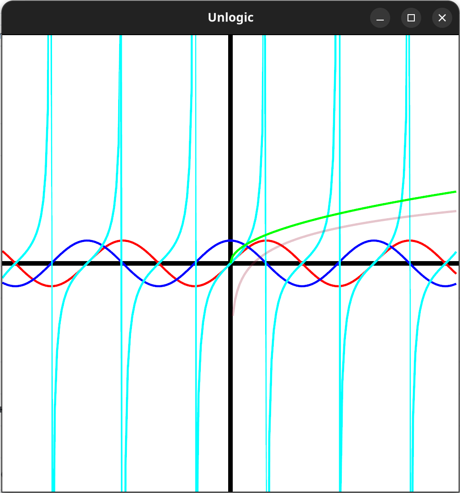

# Unlogic
A math JIT compiler and graph generator. 

## Examples

### JIT-Compiling and Running a Function
```c++
unlogic::Compiler compiler;
auto f = compiler.CompileFunction<double, double>("f(x, y) := x * y");

ASSERT_EQ(f(2, 2), 4);
```

### Graphing a Function
```c++
sf::RenderTexture texture;
texture.create(1000, 1000);

unlogic::Graph graph("f(x) := x^2");

texture.draw(graph);

sf::Image image = texture.getTexture().copyToImage();
std::vector<sf::Uint8> buffer;
image.saveToMemory(buffer, "png");
```

### Sample Render
<p align="center">
    
</p>

Rendered in `unlogic-cli` with:

```c++
unlogic::Graph graph({
    "a(x) := sin(x)",
    "b(x) := cos(x)",
    "c(x) := tan(x)",
    "d(x) := sqrt(x)",
    "e(x) := log(x)",
});
```