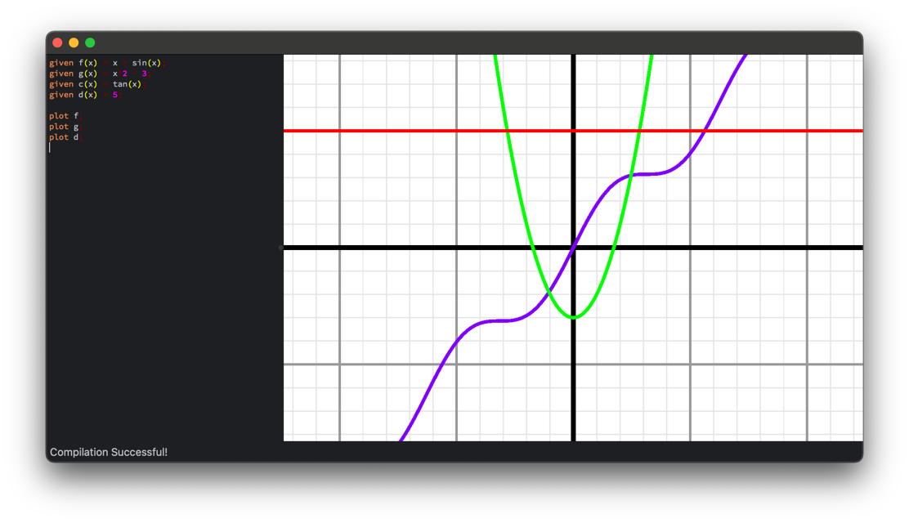

# Unlogic

A math JIT compiler and graph generator.

## Releases

`unlogic` is currently in alpha, but semi-functional test versions for apple-silicon macs can be found on the
releases page. These do not bundle the following dependencies: `qt`, `vulkan`. As such, they must be installed via
`homebrew` prior to use.

```shell
brew install qt vulkan-tools
```

## Examples

### JIT-Compiling and Running a Function

```c++
unlogic::Scene scene;
unlogic::Compiler compiler({&unlogic::stdlib, &unlogic::runtime});
auto program = *compiler.Compile("given f(x) := x^2; plot f;");

program(&scene);
```

### Calculator

<p align="center">
    
</p>

Use `unlogic-calculator`, a Qt/Vulkan-based GUI for `unlogic` to perform graph analysis.